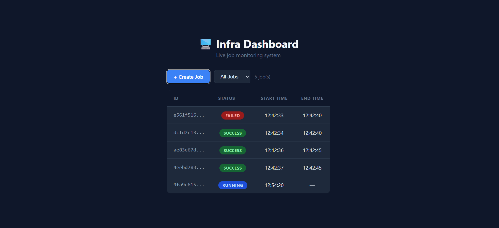

# 🖥️ Mini Infra Dashboard

A live infrastructure job monitoring dashboard built with **Node.js + Express** (backend) and **Svelte** (frontend).

Jobs are created, automatically progress through states, and the dashboard updates in real time , no manual refresh needed.

## 📸 Preview



---

## 🚀 How to Run Locally

Make sure you have **Node.js** installed.

### 1. Clone the repo
```
git clone https://github.com/nuras-nazir/mini-infra-dashboard.git
cd mini-infra-dashboard
```

### 2. Start the Backend
```
cd backend
npm install
node index.js
```
You should see: `Server running at http://localhost:3000`

### 3. Start the Frontend
Open a **second terminal** and run:
```
cd frontend
npm install
npm run dev
```
Open **http://localhost:5173** in your browser.

> ⚠️ Both terminals must be running at the same time.

---

## 🏗️ Architecture
```
intern/
├── backend/
│   ├── index.js        ← Express API + job simulation
│   └── package.json
├── frontend/
│   ├── src/
│   │   └── App.svelte  ← Main dashboard UI
│   └── package.json
└── README.md
```

**How they communicate:**
- Frontend runs on port 5173
- Backend runs on port 3000
- Frontend uses `fetch()` to call backend API every 5 seconds (polling)
- CORS is enabled on the backend so both ports can talk to each other

## 🔄 How Job Simulation Works

Every 5 seconds the backend automatically advances job states:
```
PENDING → RUNNING → SUCCESS (70% chance)
                  → FAILED  (30% chance)
```

This simulates real infrastructure where most jobs succeed but some randomly fail.
Start time is recorded on creation, end time is recorded when job finishes.

## 🤔 Design Decisions

### Why in-memory storage (no database)?
For this project, I stored jobs in a simple JavaScript array instead of a database like MongoDB or PostgreSQL. The reason is straightforward, setting up a database would add a lot of complexity (installation, connection strings, schemas) that isn't necessary for a demo. The tradeoff is that jobs disappear when the server restarts, but for a monitoring dashboard prototype, that's acceptable.

### Why polling instead of WebSockets?
The frontend fetches new data from the backend every 5 seconds automatically. A more "professional" approach would be WebSockets, where the backend pushes updates to the frontend instantly. I chose polling because it's simpler to implement and easier to understand, one `setInterval` line vs setting up a whole socket connection. At small scale (1-2 users), 5 second polling is perfectly fine.


### Why 70/30 success to failure ratio?
The background simulation gives each job a 70% chance of success and 30% chance of failure using `Math.random()`. This was a deliberate choice to simulate a realistic system in real infrastructure, most jobs succeed but occasional failures are normal. A 50/50 split would look broken, and 100% success would look fake.

### Why two separate servers?
Backend runs on port 3000, frontend runs on port 5173. They're kept separate because in real world projects, the backend (API) and frontend (UI) are always separate services they can be scaled, deployed and updated independently. CORS is enabled on the backend to allow both ports to communicate.

## ⚠️ Tradeoffs & Limitations

- **No persistence** — jobs are lost when server restarts
- **Polling is inefficient** — 100 users = 100 requests every 5 seconds
- **No authentication** — anyone with the URL can create/modify jobs
- **Single server** — would need load balancing at scale


## 🔮 What I'd Improve With More Time

- Replace polling with WebSockets for instant updates
- Add a "Retry" button for failed jobs
- Add pagination for large job lists
- Add user authentication

## 🐛 Challenges I Faced

1. **EJSONPARSE error** -- The `intern` parent folder had a broken empty `package.json` which was confusing Vite. Fixed by deleting it.
2. **PowerShell vs CMD** -- `rd /s /q` doesn't work in PowerShell. Had to use `Remove-Item -Recurse -Force` instead.
3. **Both servers must run simultaneously** -- Took me a moment to realise the frontend and backend need separate terminal windows running at the same time.
4. **Deciding the Success and Failure randomness** -- I was confused on how to decide the status probability.  

## 🤖 AI Usage Disclosure

I used **Claude (Anthropic)** as an AI assistant during this project.

**Example prompts I used:**
1. *"Explain what Svelte is in simple terms for someone who knows HTML/CSS/JS"*
2. *"My terminal is showing this error when I run npm run dev EJSONPARSE Invalid package.json: JSONParseError: Unexpected end   of JSON input while parsing empty string. I am using PowerShell on Windows. What does this mean and how do I fix it?"*
3. *"How do I make the frontend auto-refresh every 5 seconds in Svelte?"*
4. *"This is my README.md can you improve it?"*
5. *"I am building a job monitoring dashboard in Svelte. I want the table to automatically show updated job statuses every few    seconds without the user having to manually refresh the page. How do I do this? I know basic JavaScript but I am not familiar with Svelte syntax yet."*

**What AI helped with:**
- Understanding Svelte concepts from scratch as a beginner
- Debugging setup errors I had never seen before
- CSS styling for the dark theme
- Understanding how `setInterval` and polling works for auto-refresh
- Writing and improving the README

**What I did myself:**
- Understanding the output of every line of code before writing it
- Typed out all the code manually
- Debugged issues step by step
- Made design decisions about the project structure

All logic was understood and typed by me AI was used as a learning tool, not a copy-paste machine.